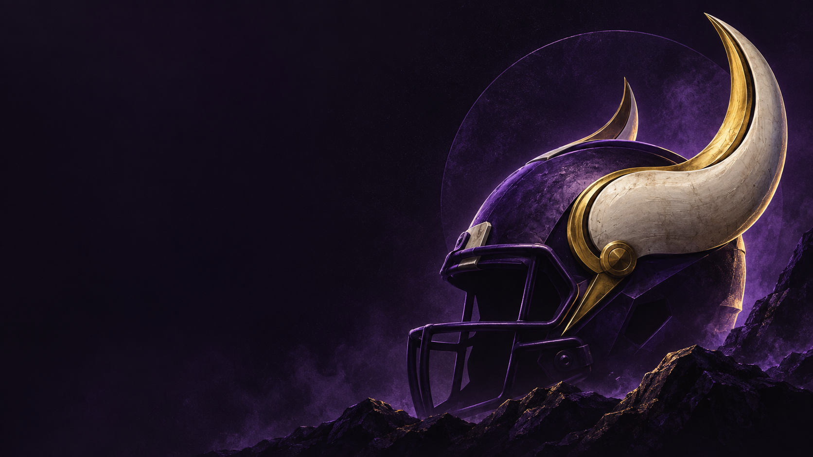
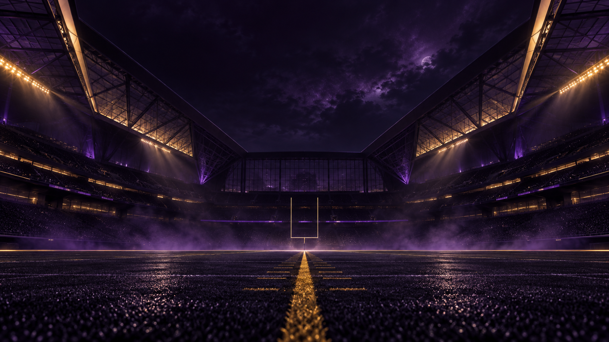

# Minnesota Vikings for Omarchy

An unofficial Minnesota Vikings-inspired dark theme with deep purple backgrounds, gold accents, ivory text, and readable lavender terminal colours.



## Install

```bash
omarchy theme install https://github.com/mlambert-uk/omarchy-minnesota-vikings-theme
```

Once installed, select it from the theme picker or run:

```bash
omarchy theme set minnesota-vikings
```

Created and tested locally with Omarchy 4.0.4. The theme uses `colors.toml` so Omarchy generates the application configurations from its own templates.

## Backgrounds

Three PNG backgrounds are included, each 1672 × 941 pixels:

- **Skol** — a purple football helmet with ivory and gold Viking horns.
- **Northern Gold** — purple aurora above a snowy Nordic lake and longship.
- **Purple and Gold Stadium** — a dramatic football stadium at night.




Choose a background with `omarchy theme bg-switcher`, or cycle with `omarchy theme bg next`.

## Palette

| Role | Colour |
| --- | --- |
| Background | `#171020` |
| Selection purple | `#4F2683` |
| Gold accent | `#FFC62F` |
| Foreground | `#F3EDF8` |
| Lavender | `#C49AEB` |

## Artwork and licence

The wallpapers are AI-generated artwork. Generation prompts are recorded in [ARTWORK.md](ARTWORK.md).

This repository is distributed under the [MIT licence](LICENSE), covering its theme configuration and included artwork to the extent the author holds rights. This is an independent fan project, not affiliated with or endorsed by the Minnesota Vikings or the NFL. No rights to third-party names or trademarks are granted.
